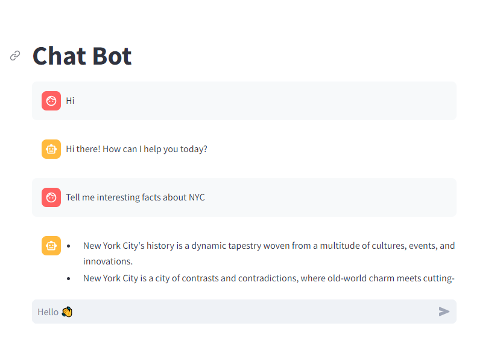

**Llama Chatbot**

This is a simple chatbot application built using Streamlit and a custom library called `llama_index`.

**Project Structure**

* `llama_index_pipeline.py`: This script defines functions for processing and indexing data for the chatbot.
* `app.py`: This script implements the chatbot user interface using Streamlit.

**Dependencies**

* Streamlit ([https://streamlit.io/](https://streamlit.io/))
* llama_index (custom library)

**How it Works**

1. **Data Processing (llama_index_pipeline.py)**
   * The script loads data from a directory (`./data`).
   * It then parses the data into sentences and creates contextual windows around each sentence (configurable window size).
   * A Hugging Face embedding model (`BAAI/bge-large-en-v1.5`) is used to generate vector representations for the sentences.
   * Additionally, a Hugging Face LLM (Llama-2 based) is used to extract titles from the data (potentially for summarization).

2. **Indexing and Querying**
   * The processed data (nodes) are indexed using a `VectorStoreIndex`.
   * A query engine is created on top of the index that utilizes the Llama-2 LLM for ranking and retrieval.

3. **Chatbot Interface (app.py)**
   * Streamlit is used to create a chat interface.
   * The chat history is stored in the session state.
   * User input is captured using a chat input element.
   * The user query is passed to the `search` function from `llama_index_pipeline.py`.
   * The `search` function retrieves relevant responses from the indexed data using the query engine.
   * The retrieved response is displayed in the chat interface.

**Running the Chatbot**

1. Make sure you have Streamlit and the `llama_index` library installed.
2. Run `app.py` using a Python interpreter (e.g., `python app.py`).
3. The chatbot interface will be accessible in your web browser at http://localhost:8501 by default.

```bash
    python -m streamlit run app.py
```



